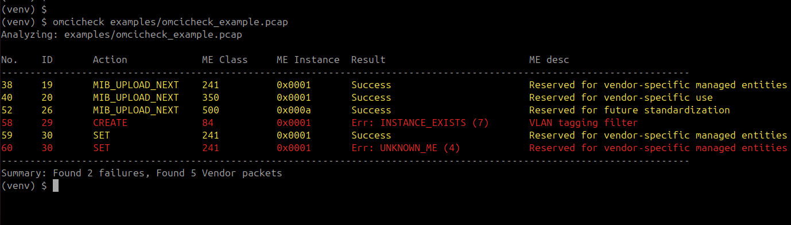
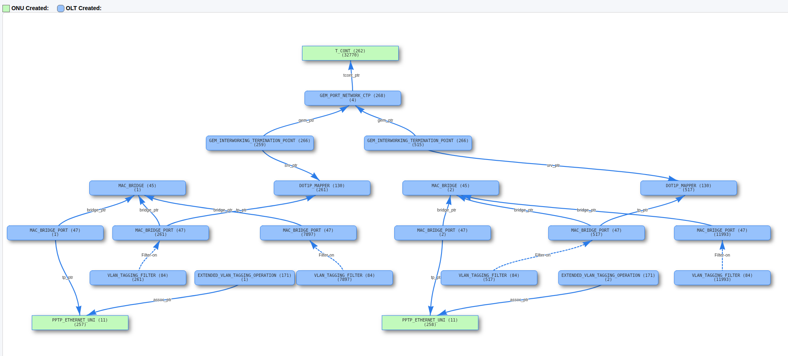
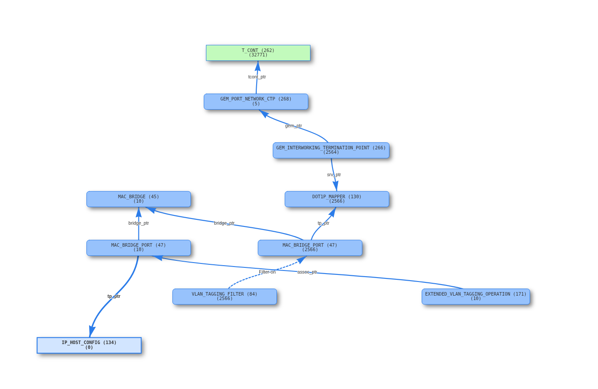
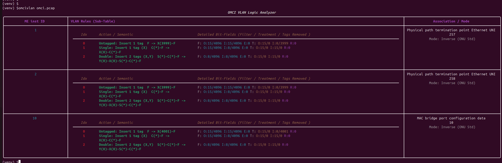

# omcipcap

`omcipcap` is a professional Python toolkit designed for analyzing and diagnosing **ITU-T G.988 OMCI** (ONT Management and Control Interface) protocols. It streamlines the process of identifying non-standard Managed Entities (MEs) and provisioning failures in GPON/XGS-PON packet captures.


## Key Features

* **`omcipcap check`**: Automatically scans pcap/pcapng files to highlight:
    * **Vendor-Specific MEs**: Identifies MEs in reserved or proprietary ranges.
    * **Provisioning Failures**: Detects non-success response codes (e.g., `UNKNOWN_ME`, `INSTANCE_EXISTS`).
    * **Intelligent Filtering**: Quickly isolate issues using `--only-vendor` or `--only-failed` flags.
    * **RTT Latency Analysis**: Automatically calculates the time difference between Request and Response. Users can flag slow packets using the --rtt-threshold (default: 1s).
* **`omcipcap diff`**: is a powerful utility for performing Differential Analysis between two MIB snapshots. It is specifically designed to help firmware engineers identify configuration drifts
    * **Dynamic ME Extension**: Use the --mib-json flag to dynamically load and overwrite ME definitions. This transforms raw hex data into readable fields without modifying the source code.
* **`omcipcap graphic`**: generates an interactive, hierarchical network topology from a MIB snapshot. It is designed to visualize the complex logical relationships between Managed Entities (MEs), helping engineers verify provisioning flows from the UNI/Management side to the ANI/T-CONT side.
* **`omcipcap vlan_tbl`**: Provides a deep-dive analysis of VLAN Tagging Filter Data and VLAN Tagging Operation Configuration Data. It decodes the complex, table-driven logic of OMCI VLAN processing into a human-readable format.
    * **Logic Reconstruction**: Automatically parses Filter/Treatment bit-fields to visualize how the ONU handles Untagged, Single-tagged, and Double-tagged frames.
    * **Semantic Mapping**: Translates raw hex values into clear actions (e.g., Insert 1 tag, Modify VID, Discard).
    * **ME Association**: Links VLAN rules directly to their associated Managed Entities, such as Physical Path Termination Points (PPTP) or MAC Bridge Ports, showing the exact association mode and instance IDs.
    * **Detailed Bit-Field Breakdown**: Includes a technical view of internal bit-fields (Filter/Treatment/Tags Removed) for senior engineers to verify exact hardware-level logic.
* **Professional Output**: Features color-coded Terminal output and standardized hex formatting for Instance IDs.

## Project Structure

```text
.
├── examples                # pcap and json samples
│   ├── iphost_graphic.png
│   ├── mib_after.pcap
│   ├── mib_before.pcap
│   ├── mib_omcc_96.pcap
│   ├── mib_omcc_a0.pcap
│   ├── mib_vendor_v1.pcap
│   ├── mib_vendor_v2.pcap
│   ├── omcicheck_example.pcap
│   ├── omcicheck_example.png
│   ├── omcivlan.png
│   ├── pptp_graphic.png
│   └── vendor_355.json
├── LICENSE                 # MIT License
├── omci                    # Core package
│   ├── cli.py
│   ├── __init__.py
│   ├── omcigrapher.py
│   ├── omcimib.py
│   ├── omci.py
│   └── omcivlan.py
├── pyproject.toml          # Build system & entry points
├── README.md               # Project documentation 
└── tests                   # Test suites & pcap generators
    ├── generate_omcicheck_example.py
    ├── generate_omcidiff_example.py
    └── test_omci_exceptions.py
```

## Installation
**Option 1: Virtual Environment (Recommended for Development)**
Use this method to keep your system Python environment clean and isolate dependencies.
```bash=
# 1. Create and activate the virtual environment
python3 -m venv venv
source venv/bin/activate

# 2. Upgrade pip and install in editable mode
pip install --upgrade pip
pip install -e .

# 3. Verify the installation
omcipcap --help
```
**Option 2: Local Directory Installation (Permanent Use)**
Use this method to make the tool available across your system without activating a venv.
```bash=
# 1. Install to your local directory
pip install . --prefix=${HOME}

# 2. Update your shell configuration (~/.bashrc or ~/.zshrc)
export PATH="${HOME}/local/bin:$PATH"
export PYTHONPATH="${HOME}/local/lib/python3.12/dist-packages:$PYTHONPATH"

# 3. Apply changes
source ~/.bashrc

```
## ⚡ Quick Start (No Python Required!)

### Download Pre-compiled Binaries
Get ready-to-run executables for your platform:

- **Windows (64-bit)**: [omcipcap.exe](https://github.com/daneshih1125/omcipcap/releases/latest/download/omcipcap.exe)
- **Linux (64-bit)**: [omcipcap_linux](https://github.com/daneshih1125/omcipcap/releases/latest/download/omcipcap_linux)
- **macOS (ARM64)**: [omcipcap_mac](https://github.com/daneshih1125/omcipcap/releases/latest/download/omcipcap_mac)

No Python installation required!

### Windows and Linux Usage

```bash
# Windows
omcipcap.exe check your_file.pcap

# Linux
chmod +x omcipcap_linux
./omcipcap_linux check your_file.pcap
```

## Sub-Command
### omcipcap check
Analyze a pcap file to display a summary of all OMCI packets:
omcipcap check examples/omcicheck_example.pcap
```


omcipcap check with --rtt-threshold argument
```bash
(venv) $omcipcap check --rtt-threshold=1500 omcicheck_example.pcap 
Analyzing: omcicheck_example.pcap

No.    ID       Action             ME Class     ME Instance  Result                         RTT          Status           ME desc                                 
------------------------------------------------------------------------------------------------------------------------
38     19       MIB_UPLOAD_NEXT    241          0x0001                                      0                             Reserved for vendor-specific managed entities
40     20       MIB_UPLOAD_NEXT    350          0x0001                                      0                             Reserved for vendor-specific use        
52     26       MIB_UPLOAD_NEXT    500          0x000a                                      0                             Reserved for future standardization     
58     29       CREATE             84           0x0001       Err: INSTANCE_EXISTS (7)       0.000033                      VLAN tagging filter data                
59     30       SET                241          0x0001                                      0                             Reserved for vendor-specific managed entities
60     30       SET                241          0x0001       Err: UNKNOWN_ME (4)            0.000032                      Reserved for vendor-specific managed entities
64     32       GET                257          0x0000                                      0            [TID_DUPLOCATE]  ONT2-G                                  
------------------------------------------------------------------------------------------------------------------------
Summary: Found 2 failures, 5 Vendor packets, 1 duplicate packets, 0 late packets

```

### omcipcap diff
 Analyze two pcap files to identify differences in MIB provisioning
```bash
# Standard comparison
omcipcap diff examples/mib_vendor_v1.pcap examples/mib_vendor_v2.pcap

# Comparison with Custom Vendor ME definitions
omcipcap diff examples/mib_vendor_v1.pcap examples/mib_vendor_v2.pcap --mib-json examples/vendor_355.json
```

Example Output
When comparing a vendor-specific configuration (Class 355), omcidiff provides a clear view of the state change:
```Plaintext
[*] Successfully loaded 1 custom ME specs.
[*] Analyzing MIB from examples/mib_vendor_v1.pcap...
[*] Analyzing MIB from examples/mib_vendor_v2.pcap...

ME (Class, Inst)                    | Attribute                           | Pcap 1                -> Pcap 2
------------------------------------------------------------------------------------------------------------------------
[*] Reserved for vendor-specific (355, 0) | CPE mode                            | 'HGU'                -> 'SFU'
[*] Reserved for vendor-specific (355, 0) | Support VOIP                        | 0x1                  -> 0x0
------------------------------------------------------------------------------------------------------------------------
```

Advanced: Custom ME JSON Format
To define your own Vendor MEs for the --mib-json flag, use the following structure:
```json
{
  "355": ["HWTC 355 ME", [
    ["CPE mode", 3, "str", False],
    ["Support VOIP", 1, "u8", False]
  ]]
}
```

### omcipcap graphic
```
omcipcap graphic omci.pcap
```
will generate output.html in current directory



### omcipcap vlan_tbl
```
omcipcap vlan_tbl omci.pcap
```
List All ME 171 instances and detail of VLAN table



## Setup omcipcap on Windows Virtual Environment
1. Create the Environment
Open your terminal in the project root directory and run:
```PowerShell
python -m venv venv
```

2. Configure Execution Policy
By default, Windows restricts running scripts like the activate file. If you see a PSSecurityException error ("scripts is disabled on this system"), run this command to allow local scripts:
```PowerShell
Set-ExecutionPolicy -ExecutionPolicy RemoteSigned -Scope CurrentUser
```
Select [Y] Yes when prompted. This is a one-time configuration.

3. Activate the Environment
```PowerShell
.\venv\Scripts\activate
```

4. Install Dependencies (Development Mode)
```PowerShell
pip install -e .
```

5. Verify the Tool
```PowerShell
(venv) PS C:\Github\omci_utils> omcipcap -h
usage: omcipcap [-h] {check,diff,graphic,vlan_tbl} ...

OMCI PCAP Diagnostic & Analysis Tool

positional arguments:
  {check,diff,graphic,vlan_tbl}
                        Available analysis commands
    check               Analyze RTT, TID duplicates, and failures
    diff                Compare MIB snapshots between two pcaps
    graphic             Generate interactive topology HTML
    vlan_tbl            Analyze OMCI VLAN tagging logic (Table-driven)

options:
  -h, --help            show this help message and exit
```

## License & Copyright
**Copyright (c) 2026 Dong Yuan, Shih daneshih1125@gmail.com
Licensed under the MIT License.**
